# DevOps

# Jenkins Master-Slave Configuration
For configuring the master-slave configuration in jenkins,

### Step 1: Install the Kubernetes plugin
To install, navigate to **Manage Jenkins > Manage Plugins** then search for *Kubernetes Plugin*. This plugin integrate the Kubernetes with Jenkins<br />
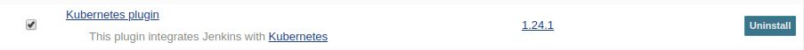<br />

### Step 2: Setup the Cloud for Kubernetes

*  Go to **Manage Jenkins > Configure System > Cloud** and click on **Add a new cloud** and select **Kubernetes** from there.<br />

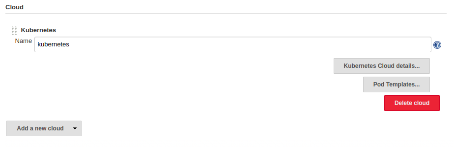<br />

*  Click on **Kubernetes Cloud Details** to enter the necessary Kubernetes details.
```
    Kubernetes URL        -> 
    Kubernetes Namespace  -> 
    Jenkins URL           ->
```
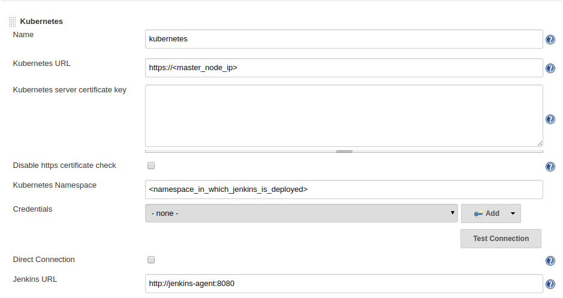<br />

**NOTE** For Kubernetes URL, use `$ kubectl config view | grep master` command.
*  Click on **Pod Template > Add Pod Template** and fill out the essentials details.
```
    Name        ->
    Namespace   ->
    Labels      ->
    Usage       ->
```
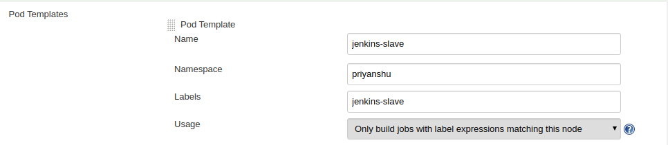<br />

*  Click on **Add Container** and fill out the necessary details.
```
    Name                                   -> jnlp
    Docker Image (Image of Jenkins-Agent)  -> gcr.io/searce-playground/jenkins-slave-tf:v1
    Working DIrectory                      -> /home/jenkins/agent
```
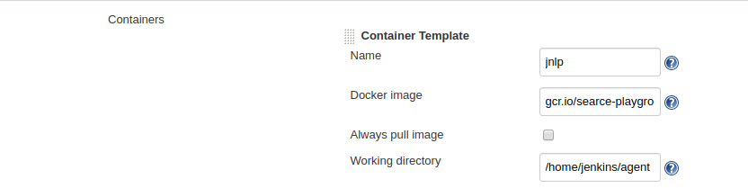<br />

*  Also mount the **Host Path Volume**.

1st
```
    Host Path    -> /var/run/docker.sock
    Mount Path   -> /var/run/docker.sock
```

2nd
```
    Host Path    -> /tmp/
    Mount Path   -> /var/artifacts
```
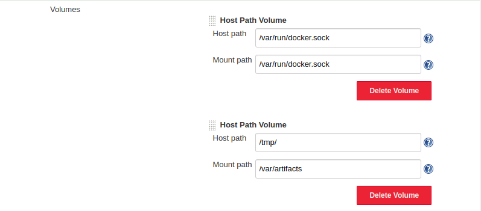<br />

*  Click on **Apply** and then **Save**.

### Step 3: Deploying Jenkins to GKE
* Go to the folder `/jenkins-to-k8s` and find the `deployment.yaml` file.
* Authenticate into your GKE cluster and deploy the yaml in the desired namespace.<br />
`$ kubectl apply -f deployment.yaml -n <namespace>`

# Jenkins-JIRA Integration

### Step 1: Install Plugins in Jenkins
To install the plugins, naviagte to  **Manage Jenkins > Manage Plugins** and install the following plugins.<br />
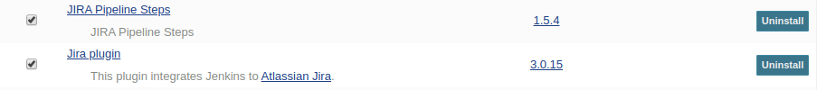<br />

### Step 2: Setup the configuration
* Go to **Manage Jenkins > Configure System** and navigate to **JIRA Steps** section to configure **JIRA Sites**.<br /> 
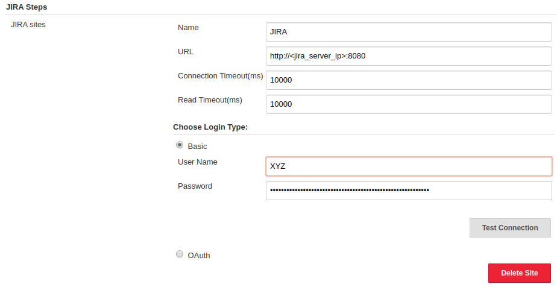<br />
**NOTE:** Always validate/test your connection after filling details.
* Going down the sections, also configure **JIRA** section and enter the **URL of the JIRA site** and add the **credentials** of your JIRA site.<br />
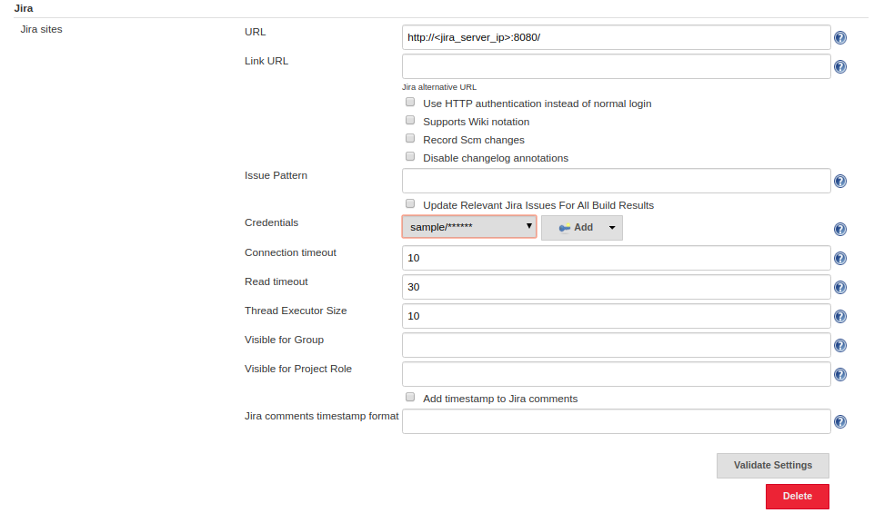<br />
**NOTE:** Always validate/test your connection after filling details.

### Step 3: Service Account in GCP for permission:
**| Point To Remember |**<br />
1. You've installed JIRA server on Google Cloud VM and for intergrating JIRA and Jenkins, you need to whitelist the Pod Address IP.

* Click on the cluster on GKE and get the **Pod Address IP**.
* Create a firewall rule and add the IP in the **Source IP Ranges** section.
* All open the port **8080** as JIRA server runs on that.<br />
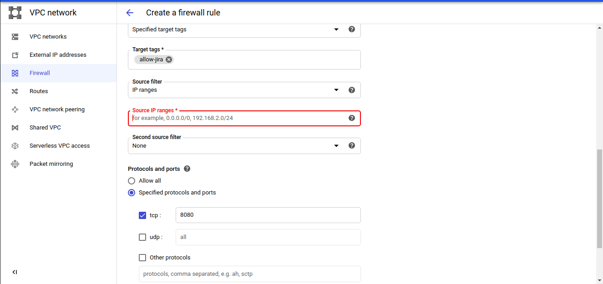<br /><br />

2. **Add credentials in Jenkins for GCP Service Account**
* After creating a service account in GCP by providing required permissions, create a key in the JSON format. For this, go to **GCP Console > IAM and Admin > Service Accounts**. Search for your service account or create a new one.

#### In GCP:
* After searching or creating the service account, click on the **three dots** at the extreme right of the service account and click on **Create Key**.
* Select **JSON** and click on **Create**.<br />
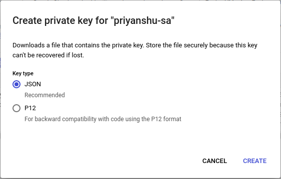<br /><br />

#### In Jenkins: 
* Go To **Manage Jenkins > Manage Credentials** and go to **global** and click on **Add Credentials**.
* In **Kind**, select **Secret text**.
* Rename the downloaded key to **credentials.json**. (It's your choice)
* Run a command in your terminal,
```
$ base64 -w0 /path_to_credentials.json
```
The ```-w0``` will remove any line breaks. Copy the whole text and paste to **Secret Text** section.
* In **ID**, write **terraform-auth** (again it's your choice) and click **Ok**
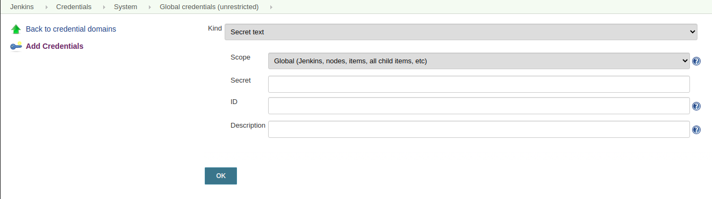<br /><br />

* In Jenkinsfile, the authentication snippet will look like this.
```
withCredentials([string(credentialsId: 'terraform-auth', variable: 'SVC_ACCOUNT_KEY')]){
  sh 'mkdir -p creds' 
  sh 'echo $SVC_ACCOUNT_KEY | base64 -d > ./creds/credentials.json'
}
```
# Github Webhook configuration to automatically trigger the Jenkins Pipeline

### In Github
#### Step 1: Create a Webhook in Github
* Go to **Settings > Webhooks**.
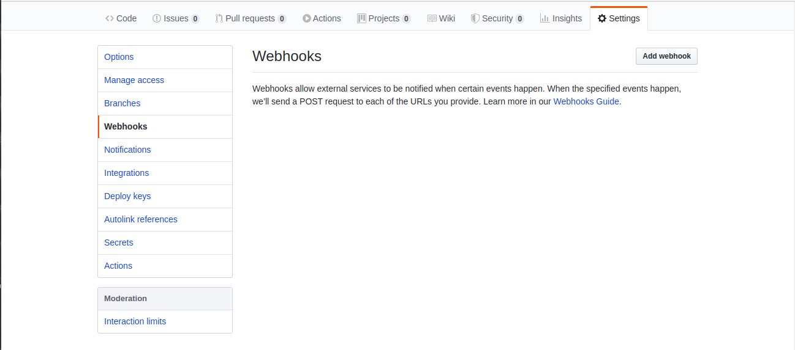 <br />
* Click on **Add Webhook** and fill the following details.
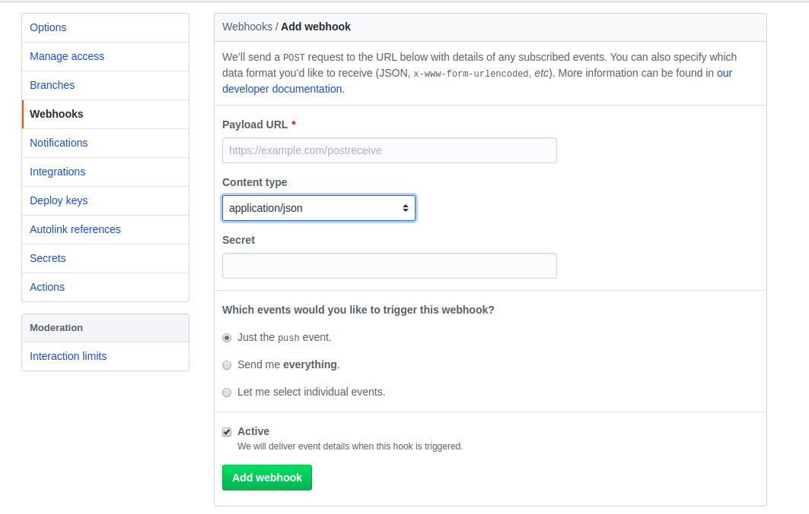<br />
```
  -> Payload URL: Enter the URL of your Jenkins
  -> Content Type: Select **application/json**
  -> You can trigger the pipeline by selecting **Just the Push Event** option but you can also select various other options by selecting individual events.
```
* Click on **Add Webook** and the webhook is successfully created.

#### In Jenkins
* Click on **New Item**. Enter Name and select **Pipeline** in the items list.
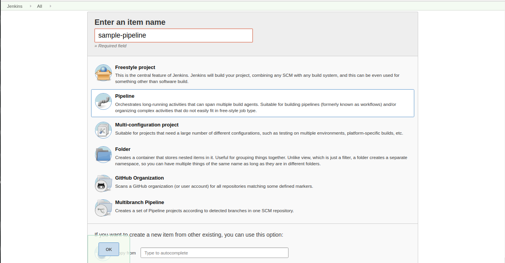<br />
* In **Build Trigger**, select **GitHub hook trigger for GITScm polling**
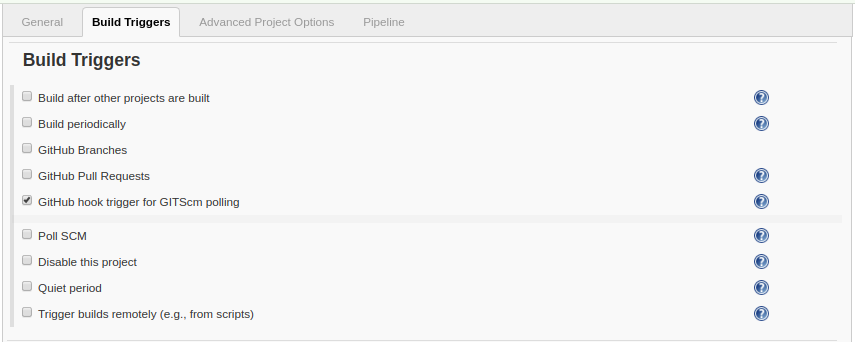<br />

**NOTE:** Don't forget to add **Checkout SCM** stage in your Jenkinsfile. If so, it may cause issue while running the polling
```
stage('Checkout'){
  checkout scm
}
```
